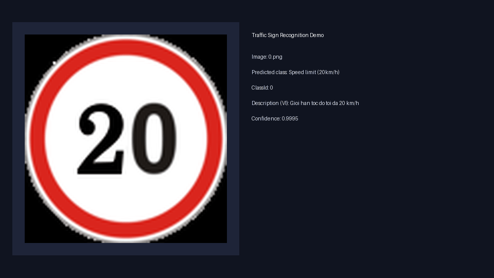

# Traffic Sign Recognition (GTSRB)

Production-style Computer Vision project for traffic sign classification with PyTorch and Streamlit.

## Highlights

- Full training pipeline on GTSRB with checkpoint saving.
- CUDA-ready workflow and cuDNN benchmark enabled when GPU is available.
- Streamlit demo app with side-by-side layout:
	- Uploaded image on the left.
	- Prediction details on the right.
- Full label support for all 43 GTSRB classes.
- Top-3 probabilities shown in app output.
- Vietnamese-friendly descriptions for predicted classes.

## Latest Result

- Best validation accuracy observed during training: around 99.63%.
- Best checkpoint: `outputs/models/best_model.pth`.
- Deployment-ready checkpoint is included in this repository for web hosting.

## Demo GIF

After generating the GIF, it is displayed below.



To regenerate demo GIF:

```bash
python scripts/generate_demo_gif.py
```

## Project Structure

```text
app/
	streamlit_app.py
configs/
	train_config.yaml
data/
outputs/
	logs/
	models/
scripts/
	generate_demo_gif.py
src/
	dataset/
	evaluation/
	inference/
	models/
	training/
	utils/
main.py
check_env.py
requirements.txt
```

## Setup

```bash
pip install -r requirements.txt
```

## Verify Environment

```bash
python check_env.py
```

## Train

```bash
python main.py train --config configs/train_config.yaml
```

## Evaluate

```bash
python main.py evaluate --config configs/train_config.yaml
```

## Predict One Image

```bash
python main.py predict --image data/Meta/0.png --config configs/train_config.yaml
```

## Run Streamlit App

```bash
python -m streamlit run app/streamlit_app.py --server.address 127.0.0.1 --server.port 8501
```

Open in browser:

- http://127.0.0.1:8501
- http://localhost:8501

## Deploy To Website

### Option 1: Streamlit Community Cloud (quickest)

1. Push this repository to GitHub (already done).
2. Go to https://share.streamlit.io
3. Click `New app` and choose:
	- Repository: `DucThanh21/Traffic_Sign`
	- Branch: `main`
	- Main file path: `app/streamlit_app.py`
4. Deploy.

Your app will get a public URL like:

- `https://<your-app-name>.streamlit.app`

### Option 2: Render (Docker)

This repository already includes deploy files:

- `Dockerfile`
- `render.yaml`
- `.streamlit/config.toml`

Steps:

1. Go to https://render.com
2. Create `New Web Service` from this GitHub repo.
3. Render will detect Docker and deploy automatically.
4. Open the generated public URL to test.

## TensorBoard

```bash
tensorboard --logdir outputs/logs
```
